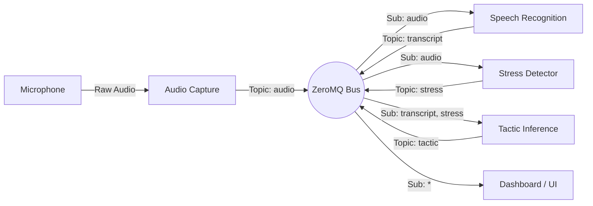

# Project Anchor - Checkpoint & Architecture Review

**Date:** February 14, 2026
**Project:** TreeHacks Anchor (Phone Scam Detection)
**Platform:** NVIDIA Jetson Orin Nano (Target), Local Dev (Supported)

---

## 1. Project Overview

**Anchor** is a real-time phone scam detection system designed to run on edge devices (specifically NVIDIA Jetson). It captures audio, transcribes speech, detects vocal stress, and infers scam tactics to warn users of potential fraud.

The system uses a **microservices-like architecture** where independent components communicate via a high-performance **ZeroMQ** message bus. This ensures low latency, modularity, and fault tolerance.

---

## 2. Current Status

| Component | Status | Description |
| :--- | :--- | :--- |
| **Message Bus** | ✅ Complete | ZeroMQ PUB/SUB spine implemented in `src/core/message_bus.py`. Handles JSON serialization and topic filtering. |
| **Audio Capture** | ✅ Complete | Microphone capture via `sounddevice` implemented in `src/core/audio_capture.py`. Publishes base64-encoded PCM chunks. |
| **Speech Recognition** | ✅ Complete | GPU-accelerated ASR using `faster-whisper` implemented in `src/core/speech_recognition.py`. Publishes partial/full transcripts. |
| **Stress Detection** | ✅ Complete | Vocal stress analysis using `wav2vec2` emotion model implemented in `src/core/stress_detector.py`. Publishes Arousal/Valence/Dominance scores. |
| **Tactic Inference** | ❌ Pending | Placeholder in `src/core/tactic_inference.py`. Logic to detect scam patterns (e.g., urgency, financial threats) is missing. |
| **Visualization** | ✅ Complete | Real-time dashboard using Flask + SocketIO implemented in `src/viz/judges_window.py`. Visualizes all pipeline signals. |
| **Orchestration** | ❌ Pending | `main.py` is empty. Need a master process to launch and manage all component threads/processes. |
| **Platform Ops** | ❌ Pending | `src/platform/jetson.py` is empty. Specific Jetson power/cooling/monitoring optimizations are needed. |

---

## 3. Architecture & Data Flow

The system follows a linear pipeline with parallel processing branches, tied together by the Message Bus.

### Data Flow Diagram

### Component Details

#### 1. Audio Capture (`src/core/audio_capture.py`)
-   **Input:** System Microphone (PortAudio/sounddevice).
-   **Output:** `audio` topic (ZeroMQ).
-   **Format:** JSON envelope containing `{"samples": "base64_int16", "rate": 16000, "timestamp": "..."}`.
-   **Key Logic:** Buffers audio in a thread-safe queue to decouple the strict audio callback from the ZMQ publisher.

#### 2. Speech Recognition (`src/core/speech_recognition.py`)
-   **Input:** `audio` topic.
-   **Output:** `transcript` topic.
-   **Model:** `faster-whisper` (CTranslate2 backend), `small` model by default.
-   **Compute:** GPU (CUDA) with float16 precision.
-   **Logic:** Accumulates audio chunks until a buffer threshold (default 1.0s) is met, then runs inference.

#### 3. Stress Detector (`src/core/stress_detector.py`)
-   **Input:** `audio` topic.
-   **Output:** `stress` topic.
-   **Model:** `audeering/wav2vec2-large-robust-12-ft-emotion-msp-dim`.
-   **Compute:** GPU (CUDA).
-   **Logic:** Analyses prosody and tone to output **Arousal** (stress), **Dominance**, and **Valence**. High arousal + negative valence indicates potential duress.

#### 4. Tactic Inference (`src/core/tactic_inference.py`)
-   **Status:** **TODO**.
-   **Input:** `transcript` (text) and `stress` (emotional context).
-   **Output:** `tactic` topic (Scam probability, Detected tactics).
-   **Goal:** Use an LLM or heuristic rules to identify scam scripts (e.g., "IRS callback", "Grandchild in jail").

#### 5. Visualization (`src/viz/judges_window.py`)
-   **Stack:** Flask + Flask-SocketIO.
-   **Logic:** Background thread subscribes to ALL ZMQ topics and pushes events to the browser via WebSockets.
-   **UI:** Dark-themed real-time dashboard showing live transcription, audio levels, stress meters, and alerts.

---

## 4. Key Architectural Decisions

1.  **ZeroMQ for IPC**:
    -   **Why:** We need extremely low latency (<50ms overhead) and the ability to run components in separate processes (to bypass Python GIL) or threads.
    -   **Pattern:** PUB/SUB allows decoupled "fire and forget" communication. Visualization can be attached/detached without affecting core logic.

2.  **GPU Acceleration**:
    -   **Why:** Running ASR and Transformer-based emotion recognition on CPU is too slow for real-time feedback.
    -   **Target:** NVIDIA Jetson Orin Nano. Code explicitly checks for CUDA and uses `float16` for performance.

3.  **Buffer-Based Processing**:
    -   **Why:** Models like Whisper and Wav2Vec2 work on context windows, not single samples.
    -   **Design:** Each consumer maintains its own sliding buffer suitable for its model (e.g., ASR needs ~1s, Stress needs ~2.5s).

4.  **Testing Strategy**:
    -   **Unit Tests:** Extensive mocking of heavy dependencies (`faster_whisper`, `torch`) to ensure logic is correct without needing a GPU in the CI environment.
    -   **Smoke Tests:** Each module has a `__main__` block for standalone verification on the target hardware.

---

## 5. Next Steps for Implementation

1.  **Implement Tactic Inference**:
    -   Create a class that subscribes to transcripts.
    -   Implement a fast keyword/regex matcher or a small local LLM (SLM) to detect scam keywords.
    -   Combine text signals with stress signals to increase confidence.

2.  **Orchestration (`main.py`)**:
    -   Write a script to spawn `AudioCapture`, `SpeechRecognizer`, `StressDetector`, `TacticInference`, and the `Flask` server.
    -   Use `multiprocessing` for CPU-bound tasks (if any) or `threading` if I/O bound (mostly GPU offload). *Recommendation: Use `multiprocessing` for the Flask server and heavy model inferences to avoid GIL contention.*

3.  **Platform Optimization**:
    -   Implement `src/platform/jetson.py` to set Jetson power modes (maximize performance) and monitor fan speeds/temperatures.

4.  **Integration Testing**:
    -   Run the full pipeline and verify end-to-end latency.
